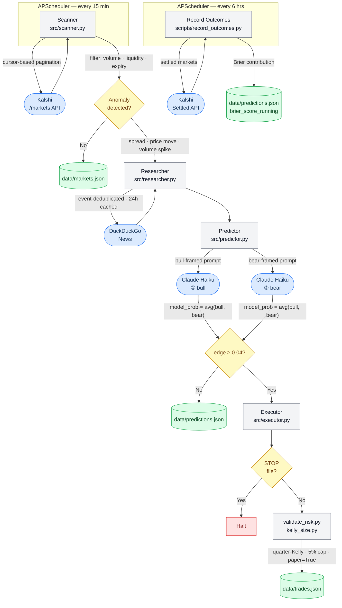

# Kalshi Prediction Market Trading Bot

An automated trading system for [Kalshi](https://kalshi.com) prediction markets. The bot runs a five-stage pipeline — Scan → Research → Predict → Risk → Execute — that identifies mispriced binary contracts, generates calibrated probability estimates via a dual-perspective LLM setup, validates trades through deterministic risk rules, and tracks forecast accuracy with Brier Score before any real capital is deployed.

---

## Why Private?

The core of this bot is its edge — the anomaly detection thresholds, LLM prompt framing, and risk parameters are tuned against live Kalshi market data. Making those public would erode the signal. The repo is private to protect strategy value, not to hide implementation quality. This README exists so technical reviewers can evaluate the engineering without needing access to the source.

---

## Technical Architecture

### Authentication — RSA-PSS

Kalshi's API requires RSA-PSS request signing. Each request is authenticated with a SHA-256 digest of `timestamp + HTTP_METHOD + path`, signed with a 2048-bit RSA private key stored in a gitignored `keys/` directory. The `kalshi_python_sync` SDK handles the signing flow; the key path and ID are injected from `.env` at startup.

No username/password auth. No token refresh. The signature is stateless and per-request.

---

### Stage 1 — Scanner (`src/scanner.py`)

Runs on a 15-minute APScheduler interval. Each cycle:

1. **Cursor-based pagination** — Fetches all open markets via `/trade-api/v2/markets` using the `cursor` field returned in each response as the query parameter for the next page (1,000 records per page). Continues until cursor is absent or empty.

2. **4-gate filter** — Markets must pass minimum volume (500 contracts), minimum liquidity ($10 on-book), maximum days-to-expiry (30), and maximum hours-to-prediction (72). Excluded tickers (crypto price contracts, energy, equities) are dropped.

3. **Anomaly detection** — Three independent checks flag a market for research:
   - **Wide spread:** `yes_ask − yes_bid > $0.05`
   - **Price move:** `|last_price − prev_price| / prev_price > 10%`
   - **Volume spike:** `volume_24h > 2× previous scan volume`

   All prices are parsed as `Decimal` from `*_dollars` string fields (e.g., `"0.1200"`). Bare integer price fields were removed from the Kalshi API in March 2026.

4. **Atomic write** — Results are written to `data/markets.json` via a temp file + rename to avoid partial reads.

---

### Stage 2 — Researcher (`src/researcher.py`)

For each anomaly-flagged market, the researcher gathers real-world context before the LLM is called.

- **DuckDuckGo news search** — Uses the `ddgs` library (no API key required). Markets are first deduplicated by `event_ticker` so a single search covers all contracts within the same event.
- **24-hour TTL cache** — Results are stored in `data/research_cache.json`. Repeated scans within 24 hours reuse cached news, reducing DDG call volume and rate-limit risk.
- **Rate limiting** — A 1-second sleep between search calls prevents throttling.

Output is a research dict per market containing the concatenated body text of the top 5 news results, passed as context to the predictor.

---

### Stage 3 — Predictor (`src/predictor.py`)

The predictor makes **two separate Claude Haiku calls per market** — one bull-framed, one bear-framed — then averages the resulting probability estimates.

**Dual-call design:**

| Call | System prompt focus |
|------|---------------------|
| Bull | "Focus on evidence supporting the YES outcome. Acknowledge uncertainty." |
| Bear | "Focus on evidence supporting the NO outcome. Give YES its due weight." |

Both calls receive the same market title, current order book mid-price, and DuckDuckGo news context. Both are instructed to respond with a single JSON object:

```json
{"probability": 0.65, "reasoning": "One sentence max."}
```

Responses are parsed with a fallback that strips markdown wrappers before JSON decode.

**Aggregation:**

```
model_prob = (bull_prob + bear_prob) / 2
market_price = (yes_bid + yes_ask) / 2
edge = model_prob − market_price
```

A market is marked `tradeable = True` if `abs(edge) >= 0.04`. Results are appended to `data/predictions.json` with full metadata including both reasoning strings.

**24-hour deduplication** — Tickers predicted within the last 24 hours are skipped to avoid redundant calls.

---

### Stage 4 — Executor (`src/executor.py`) — Paper Trading

The executor evaluates recent predictions and logs simulated trades. No real orders are placed until Phase 4 is explicitly authorized.

**Kill switch** — Before any execution loop, the system checks for a `STOP` file in the project root. If present, all execution halts immediately.

**Candidate selection:**
1. Prediction is marked `tradeable`
2. Edge still meets threshold when live price is re-fetched at execution time
3. Ticker not already in open positions
4. Market has sufficient time before close

**Position sizing — Quarter-Kelly:**

```python
# YES edge
f* = (model_prob − mid_price) / (1 − mid_price)

# NO edge
f* = (mid_price − model_prob) / mid_price

fractional = f* × 0.25          # quarter-Kelly fraction
capped = min(fractional, 0.05)  # 5% bankroll hard cap
position_dollars = capped × bankroll
```

**Deterministic risk checks** (in `scripts/validate_risk.py`):
- Edge ≥ `PAPER_EDGE_THRESHOLD` (0.10)
- Position ≤ 5% of bankroll
- No duplicate open position on same ticker
- Open positions < 20
- Daily realized losses < 10% of bankroll

Risk logic is plain Python with no LLM involvement. It is never modified by AI.

Passing trades are written to `data/trades.json` with `"paper": true` and a full audit trail: model probability, market price at prediction time, market price at execution time, edge at execution, Kelly fraction, position dollars.

---

### Stage 5 — Outcome Recording & Brier Score (`scripts/record_outcomes.py`)

Runs every 6 hours (scheduled) or on demand. For each settled market with a logged prediction:

1. **Fetches the official result** from the Kalshi API (`yes` or `no`)
2. **Computes Brier contribution:**

```
brier_contribution = (model_probability − outcome)²
outcome ∈ {1 (YES), 0 (NO)}
```

3. **Updates running Brier Score** — rolling mean across all resolved predictions

```
brier_score_running = mean(all brier_contributions)
```

The Phase 2 gate requires Brier Score < 0.25 across 50+ resolved predictions before paper trading begins. A score of 0.25 is the baseline for random guessing on binary markets; any higher means the model has no edge.

---

### Data Flow



---

### Key Design Decisions

**No market orders.** Kalshi removed market orders in September 2025. All sizing targets limit order prices derived from the order book mid-price.

**Prompt injection defense.** All external content — news text, market titles, event descriptions — is passed as data inside clearly delimited XML-like tags in the user message, never appended to the system prompt. The system prompt contains only role instructions.

**Risk logic is never LLM-generated.** Kelly sizing and all risk checks live in standalone `scripts/` files. They are plain Python with hard-coded constants and no runtime AI involvement. This is enforced by project convention, not just policy.

**Demo-first architecture.** The `ENVIRONMENT` variable controls which Kalshi host is used (`demo-api.kalshi.co` vs. `api.elections.kalshi.com`). It defaults to `demo` and cannot be changed to `production` without explicit user authorization. The two environments use entirely different hostnames, not path prefixes.

---

### Stack

| Component | Choice |
|-----------|--------|
| Language | Python 3.12 |
| Kalshi SDK | `kalshi_python_sync` ≥ 3.2.0 |
| Scheduling | APScheduler (BlockingScheduler) |
| LLM | Anthropic SDK — Claude Haiku (dual call) |
| News | DuckDuckGo (`ddgs`, no API key) |
| Config | `.env` + `python-dotenv` |
| Linting | Ruff |
| Type checking | mypy (strict) |
| Testing | pytest |

---

### Phase Gates

| Gate | Condition |
|------|-----------|
| Phase 1 → 2 | Zero errors across 3 consecutive days of scheduled market pulls |
| Phase 2 → 3 | 50+ resolved predictions, Brier Score < 0.25 |
| Phase 3 → 4 | 50+ paper trades with positive EV, all risk checks firing correctly |
| Phase 4 | 50+ live trades with verified positive results |

Currently in **Phase 3** (paper trading active, outcome recording running).

---

I'm happy to do a live walkthrough or answer any questions about the implementation. Reach out via [LinkedIn](https://www.linkedin.com/in/danielkalo) or the contact on my resume.
