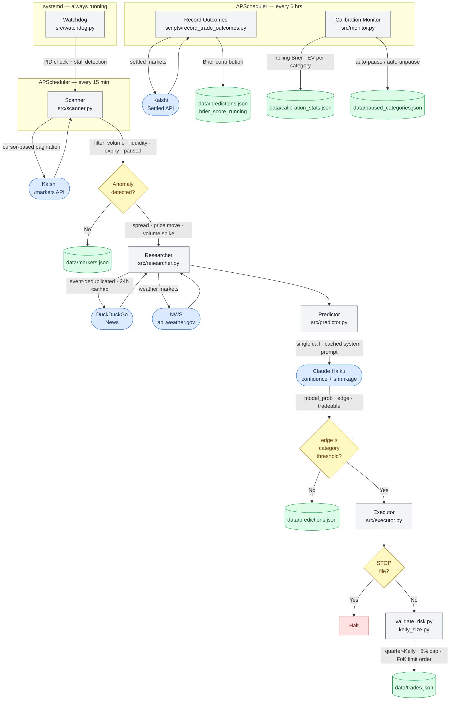

# Kalshi Prediction Market Trading Bot

An automated trading system for [Kalshi](https://kalshi.com) prediction markets. The bot runs a five-stage pipeline — Scan → Research → Predict → Risk → Execute — that identifies mispriced binary contracts, generates calibrated probability estimates via an LLM with confidence-weighted shrinkage, validates trades through deterministic risk rules, and tracks forecast accuracy with Brier Score before any real capital is deployed.

---

## Why Private?

The core of this bot is its edge — the anomaly detection thresholds, LLM prompt framing, calibration parameters, and risk rules are tuned against live Kalshi market data. Making those public would erode the signal. The repo is private to protect strategy value, not to hide implementation quality. This README exists so technical reviewers can evaluate the engineering without needing access to the source.

---

## Technical Architecture

### Authentication — RSA-PSS

Kalshi's API requires RSA-PSS request signing. Each request is authenticated with a SHA-256 digest of `timestamp + HTTP_METHOD + path`, signed with a 2048-bit RSA private key stored in a gitignored `keys/` directory. The `kalshi_python_sync` SDK handles the signing flow; the key path and ID are injected from `.env` at startup.

No username/password auth. No token refresh. The signature is stateless and per-request.

---

### Stage 1 — Scanner (`src/scanner.py`)

Runs on a 15-minute APScheduler interval. Each cycle:

1. **Cursor-based pagination** — Fetches all open markets via `/trade-api/v2/markets` using the `cursor` field returned in each response as the query parameter for the next page (1,000 records per page). Continues until cursor is absent or empty.

2. **4-gate filter** — Markets must pass minimum volume (500 contracts), minimum liquidity ($10 on-book), maximum days-to-expiry (30), and maximum hours-to-prediction (72). Excluded tickers (crypto price contracts, energy, equities, sports categories without real-time data) are dropped via `EXCLUDE_TICKER_PREFIXES`.

3. **Anomaly detection** — Three independent checks flag a market for research:
   - **Wide spread:** `yes_ask − yes_bid > $0.05`
   - **Price move:** `|last_price − prev_price| / prev_price > 10%`
   - **Volume spike:** `volume_24h > 2× previous scan volume`

   All prices are parsed as `Decimal` from `*_dollars` string fields (e.g., `"0.1200"`). Bare integer price fields were removed from the Kalshi API in March 2026.

4. **Paused-category check** — Before each cycle, `load_paused_prefixes()` reads `data/paused_categories.json` from disk. Markets in paused categories are filtered out without a process restart.

5. **Atomic write** — Results are written to `data/markets.json` via a temp file + rename to avoid partial reads.

---

### Stage 2 — Researcher (`src/researcher.py`)

For each anomaly-flagged market, the researcher gathers real-world context before the LLM is called.

- **DuckDuckGo news search** — Uses the `ddgs` library (no API key required). Markets are first deduplicated by `event_ticker` so a single search covers all contracts within the same event.
- **24-hour TTL cache** — Results are stored in `data/research_cache.json`. Repeated scans within 24 hours reuse cached news, reducing DDG call volume and rate-limit risk.
- **Rate limiting** — A 1-second sleep between search calls, with 3-attempt exponential backoff (1s / 2s), prevents throttling.
- **NWS weather injection** — For weather markets (`KXHIGH*`, `KXLOWT*`, `KXRAIN*`, `KXSNOW*`), the researcher fetches the live NWS forecast and current observations from `api.weather.gov` for the relevant station. This is the same data source Kalshi uses for settlement, so the LLM sees what the market resolves against.

Output is a research dict per market containing news context and any live weather data, passed as structured context to the predictor.

---

### Stage 3 — Predictor (`src/predictor.py`)

The predictor makes **one Claude Haiku call per market** with a calibrated system prompt that instructs the model to return a probability estimate, confidence level, and one-sentence reasoning:

```json
{"probability": 0.65, "confidence": "medium", "reasoning": "One sentence."}
```

**Confidence-weighted shrinkage:**

The raw LLM probability is shrunk toward 0.50 based on stated confidence level. This reduces overconfidence on low-evidence calls:

| Confidence | Shrinkage factor |
|------------|-----------------|
| `high`     | 0.85            |
| `medium`   | 0.70            |
| `low`      | 0.50            |

```
model_prob = 0.5 + (raw_prob − 0.5) × shrinkage
```

**Weather probability cap:**

Weather markets face irreducible forecast uncertainty regardless of NWS confidence language. Weather shrinkage is capped at 0.70 (even for `high` confidence), and `model_prob` is further clamped to `[0.25, 0.75]`:

```
# For KXHIGH*, KXLOWT*, KXRAIN*, KXSNOW*
shrinkage = min(shrinkage, 0.70)
model_prob = clamp(model_prob, 0.25, 0.75)
```

This prevents the LLM from treating NWS forecast language (e.g. "sunny, high 85°F") as near-certain when frontal systems can invalidate next-day forecasts.

**Edge calculation:**

```
market_price = (yes_bid + yes_ask) / 2
edge = model_prob − market_price
tradeable = abs(edge) >= EDGE_THRESHOLD
```

A market is marked `tradeable = True` if edge exceeds the category-specific threshold (see Stage 4). Results are appended to `data/predictions.json` with full metadata.

**Prompt caching** — The system prompt is sent with `cache_control: ephemeral`. Subsequent calls within the 5-minute cache TTL pay 10× less on input tokens.

**24-hour deduplication** — Tickers predicted within the last 24 hours are skipped to avoid redundant calls.

---

### Stage 4 — Executor (`src/executor.py`)

The executor evaluates recent predictions and places trades (paper or live depending on `ENVIRONMENT`).

**Kill switch** — Before any execution loop, the system checks for a `STOP` file in the project root. If present, all execution halts immediately. The STOP file is re-checked before each individual order attempt.

**Candidate selection:**
1. Prediction is marked `tradeable`
2. Ticker not in excluded or paused categories
3. Edge meets the category-specific minimum threshold (re-evaluated at execution time with a live price fetch)
4. Ticker not already in open positions
5. No open position on the same parent event (derived by stripping the last hyphen segment from the ticker)
6. Market has sufficient time before close
7. Live price is in `[0.05, 0.95]` — avoids near-certain contracts where the model's edge is illusory

**Category-specific edge thresholds:**

Different market categories require different minimum edge before a trade is placed:

| Category | Min edge | Reason |
|----------|----------|--------|
| Weather (`KXHIGH*`, `KXLOWT*`, `KXRAIN*`, `KXSNOW*`) | 0.12 | Irreducible NWS forecast uncertainty |
| MLB game outcomes (`KXMLB*`) | 0.15 | Sharp sportsbook lines; LLM lacks baseball-specific data |
| Default | 0.10 | Global `PAPER_EDGE_THRESHOLD` |

**Position sizing — Quarter-Kelly:**

```python
# YES edge
f* = (model_prob − mid_price) / (1 − mid_price)

# NO edge
f* = (mid_price − model_prob) / mid_price

fractional = f* × 0.25          # quarter-Kelly fraction
capped = min(fractional, 0.05)  # 5% bankroll hard cap
position_dollars = capped × bankroll
```

**Deterministic risk checks** (in `scripts/validate_risk.py`):
- Edge ≥ category-specific minimum threshold
- Position ≤ 5% of bankroll
- No duplicate open position on same ticker or parent event
- Open positions < 20
- Daily realized losses < 10% of bankroll

Risk logic is plain Python with no LLM involvement. It is never modified by AI.

**Order placement** — In `ENVIRONMENT=prod`, the executor places fill-or-kill limit orders via the Kalshi REST API. YES buys are priced at `yes_ask`; NO buys at `1 − yes_bid` (crossing the spread to hit resting volume). FoK cancellations are logged and the trade is not recorded. A `RestrictedOrdersApi` wrapper enforces that only `create_order` can be called — any other method raises `RuntimeError` before touching Kalshi.

Passing trades are written to `data/trades.json` with a full audit trail: model probability, market price at prediction time, market price at execution time, edge at execution, Kelly fraction, position dollars, order ID, and `paper` flag.

---

### Stage 5 — Outcome Recording (`scripts/record_trade_outcomes.py`)

Runs every 6 hours (scheduled) or on demand. For each settled market with a logged trade:

1. **Fetches the official result** from the Kalshi API (`yes` or `no`)
2. **Computes P&L** — contracts × (payout − entry price)
3. **Feeds calibration monitor** — updated `calibration_stats.json` drives the autonomous pause/unpause system

Prediction Brier scores are tracked separately in `scripts/record_outcomes.py`, which updates `data/predictions.json` with:

```
brier_contribution = (model_probability − outcome)²
outcome ∈ {1 (YES), 0 (NO)}
brier_score_running = mean(all brier_contributions)
```

The Phase 2 gate required Brier Score < 0.25 across 50+ resolved predictions before paper trading began. A score of 0.25 is the baseline for random guessing on binary markets.

---

### Autonomous Monitoring (`src/monitor.py`)

Three APScheduler jobs run autonomously alongside the scanner:

**Auto-exclusion validator (every 30 min)** — When the executor encounters an unknown ticker whose title contains financial price keywords ("per barrel", "yield", "price today", etc.), it auto-registers the prefix in `.env` and an audit log. The validator calls Claude Haiku to classify each unvalidated prefix as "price" (keep excluded) or "event" (false positive — reverse and add back to calibration). Uses `fcntl.flock` to prevent race conditions between concurrent scanner processes modifying `.env`.

**Calibration monitor (every 6h)** — Computes rolling Brier Score and Expected Value per ticker-prefix category from all settled trades. Auto-pauses categories where `Brier > 0.30` OR `EV < −0.02` over 10+ trades. Auto-unpauses when both recover. Writes `data/paused_categories.json` (read dynamically by scanner and executor) and `data/calibration_stats.json`. When a category is paused, it is automatically routed to the calibration scanner for continued data collection.

**Daily digest (midnight UTC)** — Writes `kalshi-digest.html` with P&L breakdown, per-category calibration stats, auto-exclusion summary, and scanner health. Single static file, always overwritten at the same path (one bookmark).

---

### Watchdog (`src/watchdog.py`)

A standalone process (managed by systemd) checks both scanner PIDs every 5 minutes. If a scanner has died (PID gone) or stalled (last scan timestamp older than threshold — 35 min for main scanner, 120 min for calibration scanner), it SIGTERMs and restarts the process. Writes `data/watchdog_health.json` after each check. The systemd unit auto-restarts the watchdog itself on crash.

---

### Data Flow



---

### Key Design Decisions

**Single LLM call with confidence-weighted shrinkage.** An earlier design used two calls per market (bull-framed and bear-framed) averaged together. The current design uses one call that returns a probability and confidence level. Shrinkage toward 0.50 is applied based on confidence — this achieves better calibration than raw averaging and reduces per-market API cost by 50%.

**Category-specific uncertainty floors.** Weather and sports markets have asymmetric uncertainty profiles. Weather forecasts carry irreducible error regardless of NWS confidence language; sports markets are priced by sharp bettors with actuarial data the LLM cannot access. Rather than applying a single edge threshold across all categories, the executor applies category-specific minimums tuned to observed Brier Score performance.

**No market orders.** Kalshi removed market orders in September 2025. All sizing targets limit order prices derived from the live order book. YES buys are placed at the ask; NO buys at `1 − bid` (crossing the spread to hit resting liquidity).

**Prompt injection defense.** All external content — news text, market titles, event descriptions — is passed as data in the user message, never appended to the system prompt. The system prompt contains only role instructions.

**Risk logic is never LLM-generated.** Kelly sizing and all risk checks live in standalone `scripts/` files. They are plain Python with hard-coded constants and no runtime AI involvement. This is enforced by project convention, not just policy.

**Autonomous calibration loop.** The system self-regulates: unknown financial tickers are auto-detected, LLM-validated, and excluded or reversed within 30 minutes. Underperforming categories are auto-paused and routed to a dedicated calibration scanner. The watchdog restarts crashed or stalled scanners. Day-to-day operation requires no manual intervention.

**Demo-first architecture.** The `ENVIRONMENT` variable controls which Kalshi host is used (`demo-api.kalshi.co` vs. `api.elections.kalshi.com`). It defaults to `demo` and cannot be changed to `production` without explicit user authorization. The two environments use entirely different hostnames, not path prefixes.

---

### Stack

| Component | Choice |
|-----------|--------|
| Language | Python 3.12 |
| Kalshi SDK | `kalshi_python_sync` ≥ 3.2.0 |
| Scheduling | APScheduler (BlockingScheduler) |
| LLM | Anthropic SDK — Claude Haiku (single call, prompt cached) |
| News | DuckDuckGo (`ddgs`, no API key) |
| Weather | NWS `api.weather.gov` (free, no API key) |
| Process management | systemd → watchdog → scanners |
| Config | `.env` + `python-dotenv` |
| Linting | Ruff |
| Type checking | mypy (strict) |
| Testing | pytest (213 unit tests) |

---

### Phase Gates

| Gate | Condition | Status |
|------|-----------|--------|
| Phase 1 → 2 | Zero errors across 3 consecutive days of scheduled market pulls | Passed |
| Phase 2 → 3 | 50+ resolved predictions, Brier Score < 0.25 | Passed |
| Phase 3 → 4 | 50+ paper trades with positive EV, all risk checks firing correctly | Passed |
| Phase 4 → live | Brier Score < 0.25 sustained over 80+ post-overhaul predictions; 50+ paper trades positive EV | In progress — recalibrating |

---

I'm happy to do a live walkthrough or answer any questions about the implementation. Reach out via [LinkedIn](https://www.linkedin.com/in/danielkalo) or the contact on my resume.
